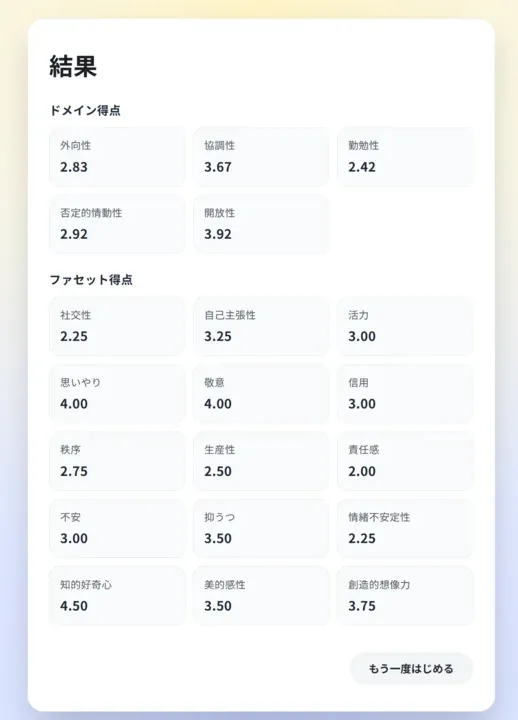

# BFI-2-J App

本リポジトリでは、BFI-2-J の質問項目と採点ロジックを用いたインタラクティブな回答支援ツールを提供し、ドメインおよびファセットの平均得点を即時にフィードバックします。
正式な教示や計算方法とは異なる可能性があることにご注意ください。

## テスト

[テストページ](https://kmizuki.github.io/BFI-2-J/)

## BFI-2-J について

BFI-2-J (Big Five Inventory-2 Japanese version) は、Big Five Inventory-2 (BFI-2) を基に日本語化された 60 項目の性格特性尺度です。

- 5 つのパーソナリティ領域（外向性・協調性・勤勉性・否定的情動性・開放性）と、それぞれに対応する 3 つのファセット（例: 外向性には社交性・自己主張性・活力）が含まれます。
- 各設問は 1 から 5 のリッカート尺度で回答し、否定表現の項目は逆転得点として処理します。
- 原版を管理する研究室 (Soto, Personality and Social Dynamics Lab) では BFI-2 系列の導入手順や配布資料が公開されています。

## 引用

Yoshino, S., Shimotsukasa, T., Oshio, A., Hashimoto, Y., Ueno, Y., Mieda, T., Migiwa, I., Sato, T., Kawamoto, S., Soto, C. J., & John, O. P. (2022). A validation of the Japanese adaptation of the Big Five Inventory-2 (BFI-2-J). _Frontiers in Psychology, 13_: 924351.

## 開発

- 依存関係のインストール: `npm install`
- 開発サーバーの起動: `npm run dev`
- 本番ビルドの作成: `npm run build`
- ビルド成果物のプレビュー: `npm run preview`
